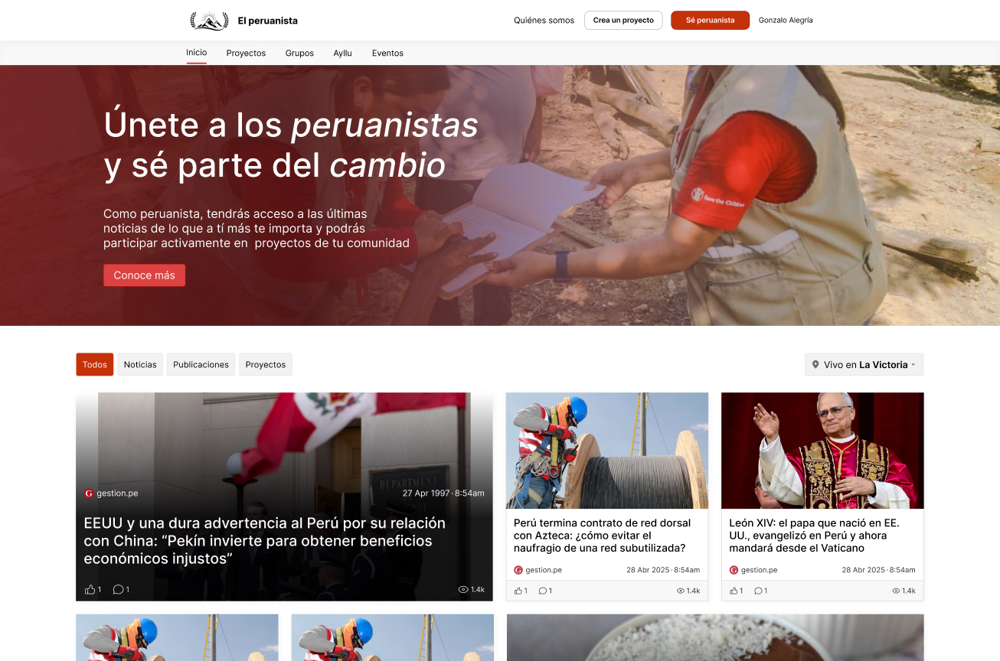

# Peruanistas

Web project for Peruanistas, the citizen participation platform.



## Technologies

- Data fetching: [Tanstack query](https://tanstack.com/query/latest)
- State management: [Zustand](https://zustand.docs.pmnd.rs/getting-started/introduction)
- Forms: [React Hook Form](https://react-hook-form.com/get-started)
- Routing: [Wouter](https://github.com/molefrog/wouter)
- Styling: CSS or [SCSS](https://sass-lang.com/) or [Tailwind](https://tailwindcss.com/)
- Auth: [Supabase Auth](https://supabase.com/docs/guides/auth)
- Icons: [Lucide React](https://lucide.dev/icons/)

## Project structure

The views and functionality is divided into features.

A feature folder can contain the following:

```txt
src/features/[name]/
├── pages:      Pages to be mounted in the main router
├── components: Reusable components
├── styles:     Reusable css/scss style sheets
├── hooks:      Reusable custom hooks
├── utils:      Reusable utility functions
├── store:      Stores, states, providers
└── types:      Type definitions
```

And more folders can be added as needed.

Currently we maintain the following features (with more to be added):

```txt
src/features/common:   Code shared by multiple features
src/features/events:   Citizen events
src/features/home:     The peruanistas main page (damero)
src/features/news:     Citizen and external news
src/features/projects: Citizen projects
```

## Getting Started

```sh
# Install dependencies
npm install
# Run the development server
npm run dev
```
